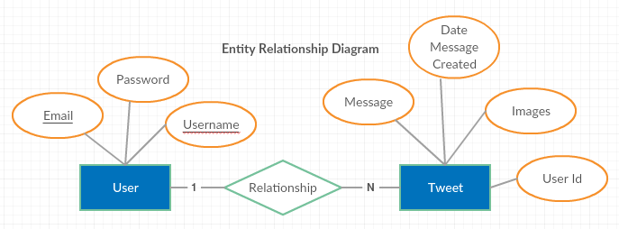
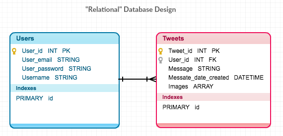
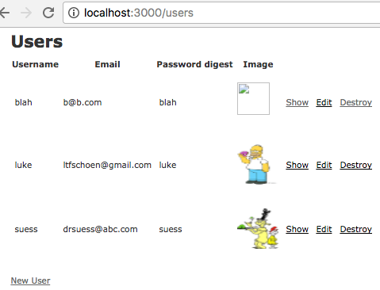

## Twitter Clone

* [Gitpitch URL](https://gitpitch.com/ltfschoen/gitpitches/twitter_mvc)

### Why use UML diagrams?

1. Visually design classes and relationships
2. Communicate DB structure with team
3. Implementation versions in code. Translate Entities into classes
4. Migrate DB schema into DB tables
5. [Link](creately.com/blog/diagrams/uml-diagram-types-examples/) (UML Diagram different types)

---

### What Entities and Attributes to use?

1. Generate User Stories
  * *As user I can view list of users*
  * *As user I can view list of tweets from a user*
  * *As user I can edit user*
  * *As user I can destroy user*
2. Identify Entities and Attributes - **Users, Tweets**
3. Identify Relationships between Entities
  * *User has many Tweets*, *Tweets belong to User*

---

### How to use Class Diagrams?

1. Sign-up to [Creatly](https://creately.com)
2. Create “Entity Relationship Diagram” schema Template.
3. Read ERD tutorial. [Link](creately.com/blog/diagrams/er-diagrams-tutorial/)


+++

4. Determine CRUD Resources
*User has many Tweets. Tweets belong to User.*

Twitter ERD


---

### How to do "relational" DB Modelling?

1. Create “Database Diagram“ schema Template
2. Read “Database Modelling” tutorial. [Link](creately.com/blog/diagrams/database-modeling-basics/)

Twitter DB Model


---

### How to create Static Pages?

1. Create app and static pages
  ```bash
  rails new twitterclone —database=postgresql;
  cd twitterclone;
  rails generate controller Pages home about \
      --stylesheet-engine=scss \
      --javascript-engine=js
  ```
2. Run server
  ```bash
  rails server
  ```
3. Open website
  ```bash
  open -a "Google Chrome" http://localhost:3000/pages/home
  ```


+++

4. Review routes
  ```bash
  rails routes
  ```
5. Change routes
  ```ruby
  root to: 'pages#index'
  get '/pages/index', to: 'pages#index'
  ```

---

### How to create Scaffold a Resource?

1. Scaffold generates Model, View, Controller (MVC) with CRUD Actions, Routes, DB Migration, Tests, JavaScript, and CSS template for a RESTful app
  ```bash
  rails g scaffold User username:string email:string password_digest:string \
    --stylesheet-engine=scss \
    --javascript-engine=js
  ```
2. Controller generated with `before_action`, which executes a given method (i.e. `set_event`) before specified Actions (i.e. `index, new, create, show, update, edit, destroy`). [Link](http://guides.rubyonrails.org/action_controller_overview.html)


+++

3. Controller generated with Whitelisted (aka [Strong Parameters](http://edgeguides.rubyonrails.org/action_controller_overview.html#strong-parameters)). Security to protect updating sensitive Model attributes
4. Model created
5. Routes `resources :users`


+++

6. [ActiveRecord Migration](http://edgeguides.rubyonrails.org/active_record_migrations.html) generates different versions of DB Schema using Ruby DSL instead of raw SQL. ActiveRecord version control history structure of DB stored in `schema.rb`. Default primary key column `id` added implicitly and timestamps for `created_at` and `updated_at` (updated by Active Record).
  * Note: Before Migration no User table exists in DB
  * Note: After Migration reversal with Active Record using `rollback` to remove User table from DB
  * Note: `up` and `down` may be used instead of `change`

---

### How to create Database and use Migrations?

1. Create DB and perform ActiveRecord Migration
  ```bash
  open -a "Postgres"
  rails db:create db:migrate
  ```
2. Run PostgreSQL Shell. Show Help. Show DB list. Switch DB. Show Tables list. Query Table. Quit
  ```bash
  psql
  \h
  \l
  \c twitterclone_development
  \d
  SELECT * FROM users;
  \q
  ```


+++

3. Drop DB
  ```bash
  rails db:drop
  ```
4. Recreate DB
  ```bash
  rails db:create db:migrate
  ```

---

### List View of Users and Create User

1. Go to link below to load /views/users/index.html.erb. Observe Server logs and [Convention over Configuration](http://rubyonrails.org/doctrine/):
  ```
  open -a "Google Chrome" http://localhost:3000/users
  ```
2. Create New User in Browser

---

### Add Migration to Update User Table with Image Attribute

1. Generate Migration to add image attribute/column to user table
  ```bash
  rails generate migration AddImageToUser image:string
  ```
2. Migrate DB Update
  ```bash
  rails db:migrate
  ```

---

### Migrate Seed Data

1. Create a hash in /migrate/seeds.rb
  ```ruby
  User.create(
    username: 'luke',
    email: 'ltfschoen@gmail.com',
    password_digest: 'luke',
    image: 'https://upload.wikimedia.org/wikipedia/en/0/02/Homer_Simpson_2006.png'
  )
  User.create(
    username: 'suess',
    email: 'drsuess@abc.com',
    password_digest: 'suess',
    image: 'https://i.pinimg.com/736x/aa/e5/a7/aae5a7c98714612266776238b05a1582--art-challenge-dr-suess.jpg'
  )
  ```


+++

2. Migrate Seed Data
  ```bash
  rails console;
  User.count;
  exit;
  rails db:seed;
  rails console;
  User.count;
  User.all.first;
  ```

---

### Update Front-End User List View using Embedded Ruby

1. Update /views/users/index.html.erb
  ```ruby
  <th>Image</th>
  ...
  <td><p>'></p></td>
  ```
2. Update /assets/stylesheets/users.scss
  ```css
  .user-images {
    width: 64px;
    height: 64px;
  }
  ```


+++

Twitter Users List Images


---

### [Customise Generators Scaffolding Workflow](http://guides.rubyonrails.org/generators.html#customizing-your-workflow)

1. Add Configuration Options to /config/application.rb to use:
  ```ruby
  config.generators do |g|
    g.orm             :active_record
    g.template_engine :erb                      # i.e. haml, slim
    g.javascript_engine :js                     # i.e. coffee
    g.stylesheet_engine :sass                   # i.e. css, less
    g.test_framework  :test_unit, fixture: true
  end
  ```
  * Benefits: Flags not necessary (i.e. `--javascript-engine=js`)

---

### Add Tweets Scaffold

1. Update /views/users/index.html.erb
  ```bash
  rails g scaffold Tweet message:string user_id:integer
  rails db:migrate
  ```

---

### Add ActiveRecord Model Associations. Update Seeds. Experiment with Associations in Rails Console

1. Add Model Associations between User and Tweets
  ```ruby
  class User < ApplicationRecord
    has_many :tweets
  end

  class Tweet < ApplicationRecord
    belongs_to :user
  end
  ```


+++

2. Update Seeds
  ```ruby
  Tweet.create(
    message: 'hallo!',
    user_id: 1
  )
  Tweet.create(
    message: 'hello!',
    user_id: 1
  )
  Tweet.create(
    message: 'bye!',
    user_id: 2
  )
  Tweet.create(
    message: 'cya!',
    user_id: 2
  )
  ```


+++

3. Migrate Updated Seeds
  ```bash
  rails db:seed
  ```
4. Create Seed using raw SQL and [Foreign Keys](https://www.postgresql.org/docs/9.5/static/tutorial-fk.html) [datatypes](https://www.postgresql.org/docs/9.5/static/datatype.html)
  ```bash
  psql
  \l
  \c twitterclone_development
  \d
  DROP TABLE users;
  DROP TABLE tweets;
  ```


+++

  ```bash
  CREATE TABLE users
  (
   id SERIAL4 PRIMARY KEY,
   username VARCHAR(255),
   password VARCHAR(255),
   email VARCHAR(255),
   image VARCHAR(255)
  );

  CREATE TABLE tweets
  (
   id SERIAL4 PRIMARY KEY,
   message TEXT,
   user_id SERIAL4 references users(id)
  );
  ```


+++

  ```bash
  INSERT INTO users (username, password, email, image) VALUES ('kermit', 'kermy', 'kerm@it.com','http://cdn.heftig.co/wp-content/uploads/2015/05/65ae356f64281952741c683297edbcb6.jpg');

  INSERT INTO tweets (message, user_id) VALUES ('nice twitter clone',1);
  ```


+++

4. Experiment with Associations in Rails Console. Save updates to DB
  ```ruby
  user1 = User.first
  user1.tweets
  user1.tweets.count
  user1.tweets.create(message: "help")
  tweet1 = Tweet.new(id: 1000, message: "eeep")
  tweet1.user
  tweet1.user = user1
  tweet1.save
  ```

  

  +++

5. Experiment with other Queries in Rails Console.
  ```ruby
  users = User.all # User.find_each
  users = User.where(username:"luke").order(created_at: :desc)
  user1 = User.find(1)
  ```

---

### Update User Profile view with their Tweets

1. Display List of User Tweets. Update /views/users/show.html.erb
  ```ruby
  <p>
    <strong>Tweets:</strong>
    <% @user.tweets.each do |tweet| %>
      <ul>
        <li><%= tweet.message %> | <%= tweet.updated_at %></li>
      </ul>
    <% end %>
  </p>
  ```

---

### References

* [Gitpitch](https://github.com/gitpitch/gitpitch)
* [Markdown cheatsheet](https://github.com/adam-p/markdown-here/wiki/Markdown-Cheatsheet)
* [Atom Markdown Preview](https://github.com/atom/markdown-preview) (CTRL+SHIFT+M)
  ```
  apm install markdown-preview
  ```
